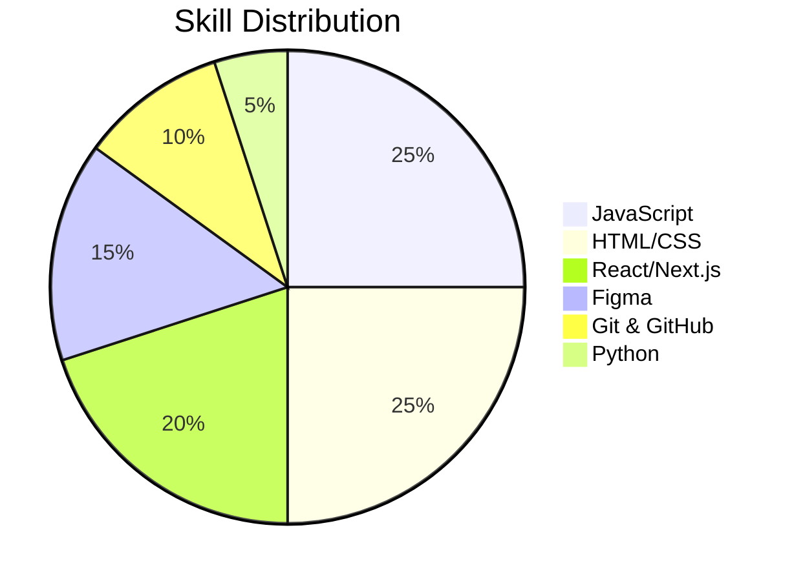

# **✨ Professional Resume - Parisan Sifizadeh**  
**Frontend Developer | Creative UI Specialist**  

## **🌊 Personal Information**  

- 🧑‍💻 Name: Parisan Sifizadeh  
- 🚀 Role: Frontend Developer  
- 🌎 English: Intermediate (B1/B2)  

---

## **🛠 Technical Skills**  

<table style="width: 100%; border-collapse: separate; border-spacing: 0 8px;">
  <tr style="background: linear-gradient(90deg, #00b4d8, #0096c7); color: white; font-size: 1.05em;">
    <th style="padding: 12px 15px; text-align: left; border-radius: 8px 0 0 8px;">Skill</th>
    <th style="padding: 12px 15px; text-align: left; border-radius: 0 8px 8px 0;">Level</th>
  </tr>
  <tr style="background-color: white; box-shadow: 0 2px 4px rgba(0,0,0,0.05);">
    <td style="padding: 10px 15px; border-left: 3px solid #00b4d8;">JavaScript</td>
    <td style="padding: 10px 15px;">★★★★★</td>
  </tr>
  <tr style="background-color: white; box-shadow: 0 2px 4px rgba(0,0,0,0.05);">
    <td style="padding: 10px 15px; border-left: 3px solid #00b4d8;">HTML5</td>
    <td style="padding: 10px 15px;">★★★★★</td>
  </tr>
  <tr style="background-color: white; box-shadow: 0 2px 4px rgba(0,0,0,0.05);">
    <td style="padding: 10px 15px; border-left: 3px solid #00b4d8;">CSS3</td>
    <td style="padding: 10px 15px;">★★★★★</td>
  </tr>
  <tr style="background-color: white; box-shadow: 0 2px 4px rgba(0,0,0,0.05);">
    <td style="padding: 10px 15px; border-left: 3px solid #00b4d8;">React</td>
    <td style="padding: 10px 15px;">★★★★☆</td>
  </tr>
  <tr style="background-color: white; box-shadow: 0 2px 4px rgba(0,0,0,0.05);">
    <td style="padding: 10px 15px; border-left: 3px solid #00b4d8;">Next.js</td>
    <td style="padding: 10px 15px;">★★★★☆</td>
  </tr>
  <tr style="background-color: white; box-shadow: 0 2px 4px rgba(0,0,0,0.05);">
    <td style="padding: 10px 15px; border-left: 3px solid #00b4d8;">Git & GitHub</td>
    <td style="padding: 10px 15px;">★★★★☆</td>
  </tr>
  <tr style="background-color: white; box-shadow: 0 2px 4px rgba(0,0,0,0.05);">
    <td style="padding: 10px 15px; border-left: 3px solid #00b4d8;">Figma</td>
    <td style="padding: 10px 15px;">★★★★☆</td>
  </tr>
  <tr style="background-color: white; box-shadow: 0 2px 4px rgba(0,0,0,0.05);">
    <td style="padding: 10px 15px; border-left: 3px solid #00b4d8;">Python</td>
    <td style="padding: 10px 15px;">★★☆☆☆</td>
  </tr>
</table>

---

## **📊 Skills Visualization**  

---

## **🚀 Projects & Experience**  

  

    

    Built responsive UIs with <strong style="color: #0096c7;">React & Next.js</strong>
  

  

    

    Created modern layouts with <strong style="color: #0096c7;">CSS Grid/Flexbox</strong>
  

  

    

    Designed prototypes in <strong style="color: #0096c7;">Figma</strong>
  

  

    

    Collaborated using <strong style="color: #0096c7;">Git & GitHub</strong>
  

---

## **📩 Let's Connect**  

  <a href="#" style="background: linear-gradient(90deg, #00b4d8, #0096c7); color: white; padding: 10px 20px; border-radius: 8px; text-decoration: none; display: flex; align-items: center; box-shadow: 0 3px 6px rgba(0,180,216,0.2); transition: transform 0.2s;">
    👨‍💻 GitHub
  </a>
  <a href="#" style="background: linear-gradient(90deg, #00b4d8, #0096c7); color: white; padding: 10px 20px; border-radius: 8px; text-decoration: none; display: flex; align-items: center; box-shadow: 0 3px 6px rgba(0,180,216,0.2); transition: transform 0.2s;">
    🔗 LinkedIn
  </a>
  <a href="#" style="background: linear-gradient(90deg, #00b4d8, #0096c7); color: white; padding: 10px 20px; border-radius: 8px; text-decoration: none; display: flex; align-items: center; box-shadow: 0 3px 6px rgba(0,180,216,0.2); transition: transform 0.2s;">
    ✉️ Email
  </a>

  Designed with 💙 by Parisan Sifizadeh | 2024

**Color Palette Used:**  
🔵 #00b4d8 (Primary Blue)  
🌊 #0096c7 (Dark Blue)  
💎 #0077b6 (Deep Blue)  
☁️ #caf0f8 (Light Blue)  
⚪ #f0f9ff (Background Gradient)

**Design Highlights:**  
✔ Modern aqua-blue color scheme  
✔ Gradient backgrounds  
✔ Soft shadows and rounded corners  
✔ Interactive buttons with hover effects  
✔ Clean typography with emoji accents  
✔ Responsive layout  

